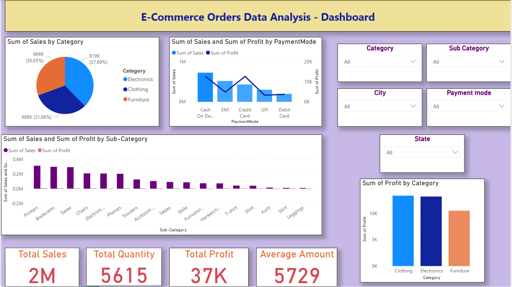
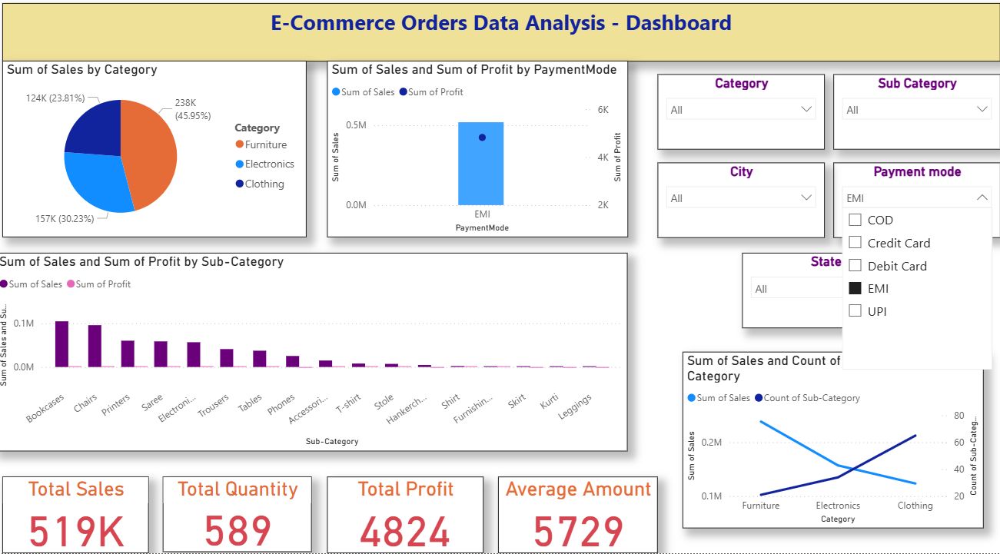
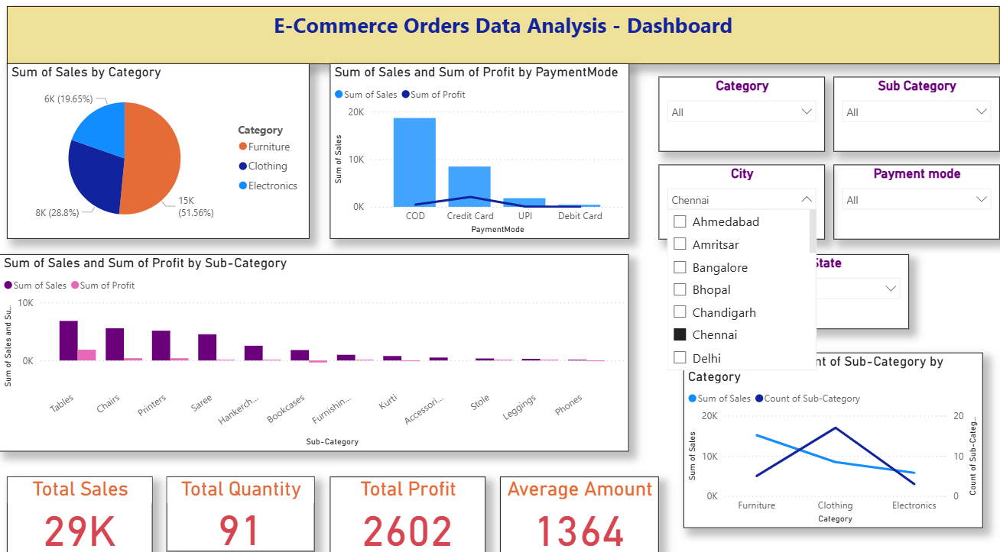

# 📊 Sales Analytics Dashboard – Power BI

A fully interactive **Sales Analytics Dashboard** built using **Microsoft Power BI**.  
This project analyzes sales performance across multiple dimensions such as product, region, category, payment mode, and sub-category.  

It enables organizations to make data-driven decisions by visualizing KPIs, identifying trends, and comparing performance across segments.

---

## 🚀 Project Overview

This dashboard provides:
- An overall view of sales performance  
- Product-wise, region-wise, and paymentmode-wise insights  
- Interactive filters for dynamic exploration  
- Clear KPIs for quick decision making  
- Data cleaning & transformation using Power Query  
- Advanced calculations using DAX  

---

## 🧩 Features

### 🔹 **1. KPI Overview**
- Total Sales  
- Total Quantity Sold  
- Total Profit  
- Average Order Amount  

### 🔹 **2. Product Insights**
- Sales by Product Category  
- Top-selling and least-performing categories  
- Profit contribution by product  
- Category-level comparisons  

### 🔹 **3. Regional Analysis**
- Sales by City & State  
- Region-specific profit margin analysis  

### 🔹 4. Sub-Category Analysis

- Sales & profit by sub-category

- Identification of high-profit and low-performing items

### 🔹 5. Payment Mode Analysis

- Sales distribution across COD, Credit Card, UPI, EMI, etc.

- Profit variation by payment mode

🔹 6. Interactive Filters

### 🔹 **6. Interactive Filters**
Filter by:
- Category  
- Sub-Category  
- City 
- State  
- Payment Mode  

---

## 🛠️ Tech Stack

| Component | Technology |
|----------|------------|
| Data Visualization | Power BI Desktop |
| Data Cleaning | Power Query (M Language) |
| Calculations | DAX |
| Data Source | CSV / Excel |
| Output | PBIX Interactive Dashboard |

---

## 📁 Project Structure

PowerBI-Sales-Analytics-Dashboard/
│── E-Commerce-Order-Analysis-Dashboard.pbix
│── README.md
│── dataset/
│     ├── Details.csv
│     └── Orders.csv
│── screenshots/
      ├── dashboard_overview.png
      ├── dashboard_paymentmode_filter.png
      └── dashboard_city_filter.png

## 📸 Dashboard Screenshots

### 🔹 Dashboard Overview

### 🔹 Dashboard with Payment Mode Filter

### 🔹 Dashboard with City Filter (Chennai)

### 📥 How to Open the Dashboard

- Download the .pbix file from this repository.

- Install Microsoft Power BI Desktop if not already installed.

- Open the file using Power BI Desktop.

### 📥 How to Open the Dashboard

- Download the .pbix file from this repository.

- Install Microsoft Power BI Desktop if not already installed.

- Open the file using Power BI Desktop.

- Explore the interactive visuals using the filters (Category, Sub Category, City, State, Payment Mode).

### Key Insights

- Clothing category generated the highest sales across all regions.

- Payment modes like COD and EMI contribute significantly to total revenue.

- Top-performing sub-categories include Bookcases, Chairs, and Printers.

- Chennai shows strong sales performance with high profit margins.

- Several sub-categories show low or declining profit, indicating improvement opportunities.